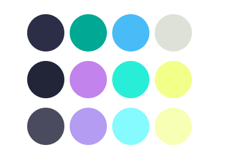
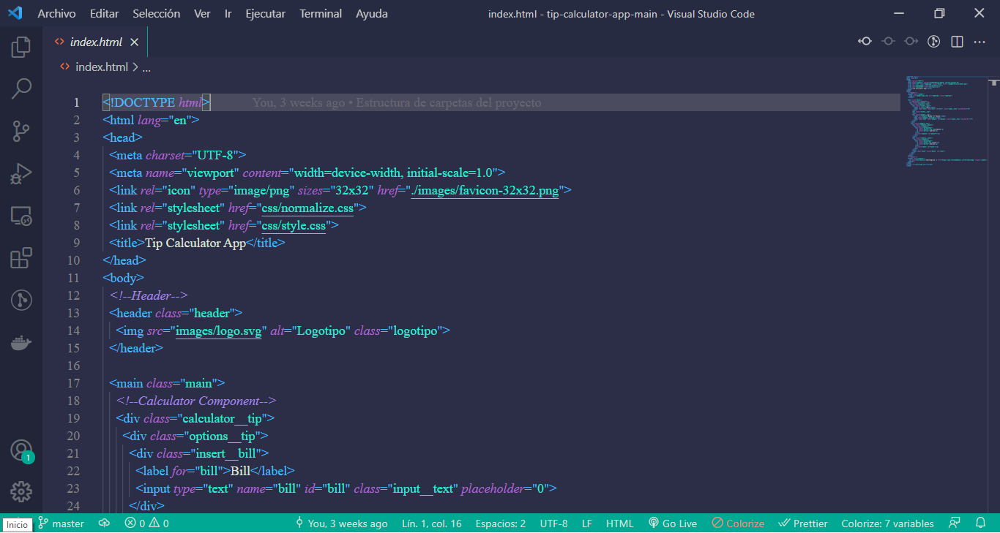
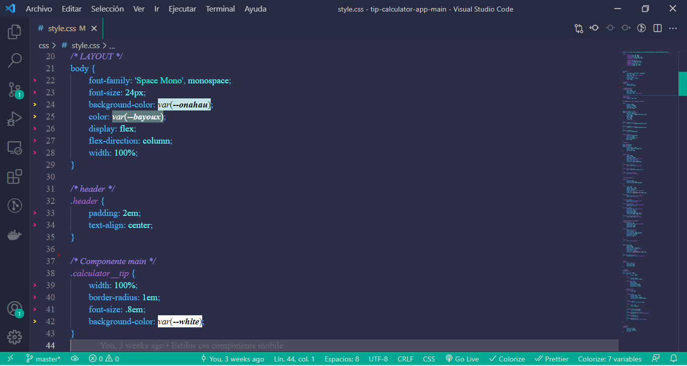
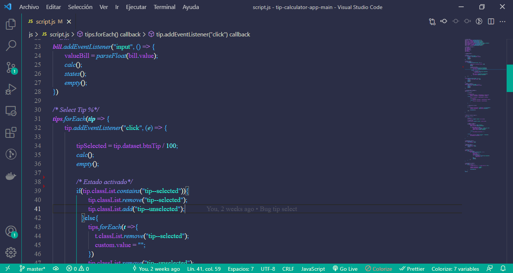

# Valhalla Theme
## *Palette inspired by valhalla color* - Paleta inspirada en el color valhalla

## *Screenshots* - Capturas de pantalla
### Dark Theme HTML

### Dark Theme CSS

### Dark Theme JavaScript

## *Contributions*

*Contributions are always welcome.*

*You can help me  with this project in several ways:*

- *Report a bug.*
- *Share and recommend among your friends.*
- *Drop a star if you like it.*
- *If you want to join me improving this project, please, feel fre to ask.*

_____________________________________________________

## Contribuciones

Las contribuciones siempre son bienvenidas.

Puedes ayudarme con este proyecto de varias formas:

- Reporta un error.
- Comparte y recomienda entre tus amigos.
- Valorándolo con una estrella si te gusta.
- Si quieres unirte a mí para mejorar este proyecto, no dudes en preguntar.

## *License* - Licencia

[MIT License](https://github.com/Vanesa-R/Valhalla/blob/master/LICENSE.md)
